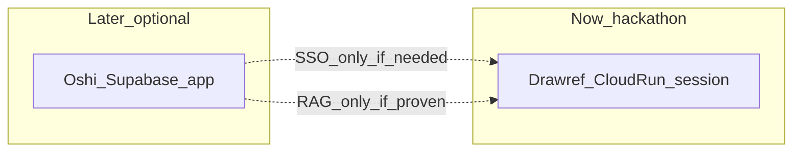

# 認証・隔離設計（主催者確認反映）

## 主催者からの確認（利用者報告）

| 方針 | 意味 |
|------|------|
| セキュリティ重視 | 審査で「制御・セキュリティ」を見る。甘い共有は減点 |
| ゲストのように入りたい | メール／Google 必須は避け、ワンクリックで触れる |
| ユーザー間共有は不可 | 履歴・アップロード・RAG を他人と共有する設計は不可 |
| RAG も入れたい | PDF コーパスも **owner 単位**。全ユーザー共通コーパスは不可 |

公式の提出ルール（テストアカウント可・ソーシャル／メール必須回避）と矛盾しない。**「入りやすい」と「データが混ざる」は別問題**として解く。

## サービス公開時も同じか

**必須ではない。公開＝すぐ IdP 導入、でもない。**

| 公開後のプロダクト要件 | 認証 |
|------------------------|------|
| ブラウザを閉じたら履歴が消えてもよい／端末内だけで続けばよい | **今と同じ署名セッションのままでよい** |
| 「自分の履歴を別端末でも見たい」「アカウントとして残したい」 | そのとき **本ログインを足す**（候補は Email/Password や、推し活と同じ人なら Supabase Auth） |
| 推し活とユーザーを共通化したい需要が実証された | Supabase Auth を `owner_id` に載せる（任意） |

公開初日から Firebase / Supabase 必須、とはしない。  
隔離の仕組み（`owner_id`）は据え置き、**ログイン手段だけ後から差し替える**。

ハッカソン提出物の説明では「自前セッションでテナント隔離」と書けば足りる。公開ロードマップに IdP 名を先に固定しなくてよい。

## ハッカソンで使う認証（この前提の答え）

前提: アプリ単体・セッション隔離・他人とデータが混ざらない。

**使うもの: 自前の署名付きセッション（Cookie）だけ。**

| 項目 | 内容 |
|------|------|
| 製品名 | **なし**（Firebase Auth / Identity Platform / Supabase Auth / Google ログインは使わない） |
| 仕組み | Cloud Run API が `session_id` を発行し、`SESSION_SIGNING_SECRET` で署名した **HttpOnly Cookie** を付与 |
| ユーザー操作 | 「はじめる」ワンクリック（メール・パスワード・OAuth なし） |
| 認可の単位 | Cookie から得た `owner_id`（＝ session_id）。写真・履歴・将来の RAG はすべてこの ID 配下 |
| 審査員向け | URL を開いて始めるだけ。共有デモアカウントは作らない |

これは「認証 SaaS を契約する」話ではなく、**匿名セッションによるアクセス制御**です。第三者の IdP は不要です。

## 推し活グッズ管理と「同じアプリ」にすべきか

利用者の前提: 用途はかなり違う。グッズを RAG で資料参照する需要は「いるかな？」程度。

### 一般的な切り方

| 状況 | よくある選択 |
|------|----------------|
| 主目的・画面・データモデルが違う | **別アプリ（別デプロイ）** |
| 同じ人が両方使うが機能は独立 | **別アプリ＋ログインだけ共有（SSO）** |
| 一方のデータを他方が毎日読む | 別アプリのまま **API 連携** |
| ほぼ同じ画面で機能が増えただけ | 同一アプリにモジュール追加 |

「将来ちょっと連携するかも」だけでは統合しない。統合すると、デプロイ・権限・審査説明・障害範囲が全部太る。

### この案件での推奨

**同じアプリにしない。別プロダクトのまま。**

| 理由 | 内容 |
|------|------|
| ジョブが違う | 絵の資料分解 vs グッズ在庫・推し活管理 |
| RAG 連携は仮説 | 需要が薄いなら、ハッカソン必須にしない（idea の後回しのまま） |
| 大会制約 | 本リポは Cloud Run＋Gemini が主役。推し活の Supabase 中心構成と無理に一本化しない |
| 失敗の分離 | 片方を壊しても他方が生きる |

連携するなら、強い順に **やらなくてよい → 弱い → 強い**:

1. **やらない（推奨・当面）**: データも画面も独立。認証もハッカソン中は自前セッションのみ。
2. **弱い（提出後・本当に同じ人が使うと分かってから）**: 同じ Supabase Auth だけ共有（ログイン共通）。データは各アプリのまま。
3. **強い（需要が実証されてから）**: グッズ metadata をこの API が読む、または PDF/画像を RAG に載せる。仮説の段階では作らない。

グッズ管理を「参照コーパス」にするのはプロダクト実験であり、**認証設計の前提にしない**。

## 結局「何のサービス」で認証するか

| 時期 | 認証サービス | 製品名 |
|------|--------------|--------|
| **ハッカソン提出まで** | **自前セッション**（Cloud Run API が発行・検証する署名付き Cookie） | Firebase Auth / Identity Platform / Supabase **は使わない** |
| **提出後・両アプリを同じ人が使うと分かったとき** | 必要なら **推し活と同じ Supabase Auth**（任意） | 必須ではない。別アプリのままメール無しセッション継続でも可 |

「認証サービスを今選ぶ」必要はない。今入れるのは **隔離のためのセッション層**。推し活統合は前提にしない。

### 推し活との連携（需要が出てから）

1. 当面は **連携なし**（推奨）。
2. 同じユーザー基盤が欲しくなったら、同じ Supabase の JWT `sub` を `owner_id` に載せる。
3. グッズ→RAG は別判断。認証共有より後。



## 結論（決め）

| 項目 | 採用 |
|------|------|
| アプリ構成 | **別アプリのまま**（統合しない） |
| グッズ×RAG | **ハッカソンでは作らない**。仮説のまま後回し |
| 今すぐ実装するか | **する**（セッション＋owner 隔離）。共有 store のまま進めると減点リスクと RAG 後戻りが大きい |
| 審査・デモの入り方 | **ワンクリック「はじめる」** → サーバーが **一意の session_id** を発行し HttpOnly Cookie に載せる（登録なし） |
| データの境界 | すべての写真・出典履歴・チャット・（将来）RAG は **`owner_id = session_id`（のち任意で user.sub）** |
| 共有してよいもの | **読み取り専用のサンプル写真カタログ**のみ |
| 固定 `demo` 全員同一 ID | **不採用** |
| ハッカソンの IdP | 自前の署名セッションのみ |
| 推し活 SSO | **任意・提出後**。需要と同一ユーザーが確認できてから |

現状の [apps/api/app/store.py](apps/api/app/store.py) はプロセス内の **全リクエスト共有辞書**で、`photo_id` さえ分かれば他人のデータに触れる。このまま Firestore に載せるのは主催者方針に反する。

```mermaid
flowchart TB
  subgraph entry [Easy_entry]
    click[Click_hajimeru]
    click --> mint[API_mints_session]
    mint --> cookie[HttpOnly_Secure_Cookie]
  end
  subgraph isolate [Per_owner_data]
    cookie --> api[Cloud_Run_API]
    api --> photos["GCS_photos_owner_id"]
    api --> hist["Firestore_owner_id"]
    api --> rag["RAG_corpus_or_filter_owner_id"]
  end
  subgraph shared_ok [Shared_read_only]
    samples[Sample_photo_catalog]
    samples -->|"copy_into_session_or_analyze_in_session"| api
  end
```

## Phase 0（ハッカソン必須）— セッション隔離

### 流れ

1. 初回（または Cookie 無し）: `POST /sessions` → `{ session_id }` + `Set-Cookie`（署名付き。改ざん不可）。
2. 以降の `POST /photos` 等は Cookie 必須。無い・不正なら 401（業務エラーコードで返す）。
3. 保存時に必ず `owner_id` を付ける。取得時は `resource.owner_id == principal.id` 以外 404（存在を漏らさない）。
4. UI: 「はじめる」だけでコア動線。ログインフォームは出さない。
5. 提出の「動作確認の方法」: 「URL を開き『はじめる』→ サンプル写真」と書く。共有パスワードは書かない（書いても同一 ID にしない）。

### Principal

```text
Principal = { kind: "session" | "user", id: str }
# Phase0: kind=session, id=署名から得た session_id
# Phase1+: kind=user, id=Supabase sub（別ブランチ）
```

クエリの `user_id` / `owner_id` は信じない（[api_contract.mdc](.cursor/rules/api_contract.mdc)）。

### サンプル写真

- カタログは公開読み取り可（静的アセットまたは `GET /samples`）。
- 「サンプルを使う」は **そのセッション内で解析結果を作る**（他人の履歴一覧は無い）。
- サンプル原画の共有 ≠ ユーザー生成データの共有。

### セキュリティ（審査で見せる点）

- テナント隔離（owner 強制）
- 署名 Cookie（秘密は `SESSION_SIGNING_SECRET`、ブラウザに出さない）
- CORS 本番オリジン限定
- 画像サイズ上限（既存）
- ログに Cookie / Authorization 全文を出さない
- （余力）セッションあたりのレート制限

## RAG（P1だが境界は今決める）

| ルール | 内容 |
|--------|------|
| アップロード PDF | GCS パスに `owners/{owner_id}/...` |
| コーパス | **owner ごと**に作る、またはチャンク metadata に `owner_id` を必須にし、検索クエリで必ずフィルタ |
| 禁止 | 全ユーザー共有の1コーパスで横断ヒット |
| ゲストセッション | セッション終了／TTL 後にコーパス削除（費用と隔離） |

idea の「後回し RAG」を実装するときも、この境界を破らない。

## Phase 1（提出後・任意）

- 両アプリを同じ人が使う需要が確認できたら、Supabase JWT を同じ `owner_id` スロットに載せてよい。
- 需要が無ければ、セッション隔離のまま公開してよい（推し活と無理に繋がない）。
- ゲスト／セッション試用は残してよい。

## Phase 2（需要実証後のみ）

- グッズ metadata や所持画像を RAG に載せる等は、利用が確認されてから。認証共有より後。
- ハッカソン必須条件・MVP とは独立。

## 実装タスク（承認後）

1. **文書**: architecture / env-contract / idea / demo-script に上記を反映。
2. **API**: `POST /sessions`、Cookie 検証、`resolve_principal`。
3. **store**: `owner_id` 付き。`get_photo` は owner 不一致なら None。
4. **web**: 起動時にセッション確保。「はじめる」または初回自動。
5. **RAG**: 設計だけ今書く。実装は tasks の P1。

## 捨てる案

- 全員共通の `demo` ユーザー1つで履歴共有 → **主催者方針に反し減点**。
- 認証なしのグローバル `photo_id` 辞書のまま本番へ → 同上。
- 審査のために Firebase Auth 必須化 → 不要。セッションで足りる。
- ハッカソン提出物を Supabase ログイン必須にする → 審査摩擦＋必須条件の説明がぼける。

## 規約との両立（再確認）

- 必須は Cloud Run＋Gemini のまま。
- 「ゲストのように」＝登録なしセッション。メール／ソーシャル必須にしない。
- セキュリティ＝**隔離と秘密境界**をアーキテクチャ図とデモで明示する（ログイン製品名ではない）。
