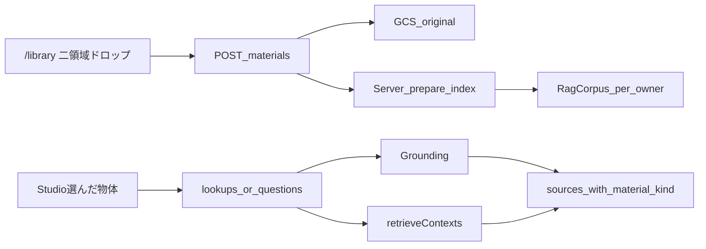

# RAG：登録・保存・自動提示（自作／他者の区別）

## 前提（採用）

- **設計だけでなく実装する**（アップロード・GCS保存・RAG呼び出し・画面）。
- 認可は既存の署名セッション Cookie（`owner_id`）。追加の IdP は入れない。
- 「自作か」は AI 推測しない。**ドロップ領域で申告**する。
- 登録 UX は **別画面 `/library`**。Studio は解析・調べる・チャットに集中する。
- **アップロードする人の負担を最小にする**（前処理・変換・圧縮を利用者に求めない）。

## UX（採用）— 負担を減らす

| 画面 | 役割 |
|------|------|
| `/`（Studio） | 写真 → 層／関節 → 自動検索・チャット。結果に **Web＋手元 RAG** を併記。ヘッダから「資料庫」へ |
| `/library` | 蓄積資料の登録と一覧だけ |

ライブラリのドロップは **左右（または上下）の二領域**:

1. **自分の作品** → `material_kind=own_work`
2. **他者の資料** → `material_kind=third_party`

負担を減らす具体策（採用）:

- 落とすだけ／選ぶだけ。**圧縮・リサイズ・形式変換はサーバー側**
- **複数ファイルを一度に**ドロップ可（領域ごとに）
- タイトルは **ファイル名をそのまま**（任意リネームは後回し）
- 進捗は「登録中…」程度。失敗はファイル単位で日本語メッセージ
- セッション未開始なら「はじめる」へ誘導（メール登録なし）
- カメラ RAW だけは非対応（案内一文）。それ以外の許可形式は変換不要

自動提示のタイミング:

1. **「この物体を調べる」** → Web grounding ＋ クエリ＝物体ラベルで RAG
2. **チャット** → クエリ＝`ラベル + 質問` で RAG。権利は種別で分岐

## 許可形式（採用）

| 種別 | 拡張子 | 索引用の扱い |
|------|--------|--------------|
| 画像 | `.jpg` `.jpeg` `.png` `.webp` | 長辺約 2048px の派生物を index。原寸は GCS |
| PDF | `.pdf` | 本体を index（Engine／テキスト抽出） |
| Word | `.docx`（`.doc` は可能なら。難しければ docx 案内） | サーバーで本文テキスト抽出して index |
| Excel | `.xlsx`（`.xls` は可能なら。難しければ xlsx 案内） | シートをテキスト化して index |
| テキスト | `.md` `.txt` | 本文をそのまま index |

受けない: カメラ RAW（CR3 / NEF / ARW 等）、実行ファイル、暗号化 Office。

`media_type`: `image` \| `pdf` \| `word` \| `excel` \| `note`

## サイズとコスト（採用）

| 経路 | 上限 |
|------|------|
| Studio 解析写真 | **10MB**（変更なし） |
| `/library` 原寸（全許可形式） | **100MB**／ファイル |
| セッション | **30件** または合計 **2GB**（先に達した方） |

方針: **原寸は GCS に残し、高い索引だけ小さく／テキスト化する。**

一眼の目安: JPEG は数〜20MB 程度、RAW は 25〜80MB 前後が多い → 原寸 100MB で JPEG は余裕。RAW は非対応なので JPEG 書き出しを一文で案内（利用者作業はそれだけ）。

## データと境界

GCS:

- `owners/{owner_id}/materials/own_work/{doc_id}/{filename}`
- `owners/{owner_id}/materials/third_party/{doc_id}/{filename}`
- 索引用派生物は同配下の `index/` など（公開しない）

必須メタ: `owner_id`, `material_kind`, `doc_id`, `title`, `media_type`, `page`（無ければ `unknown`）

コーパス: owner ごと遅延作成。横断禁止。

著作権:

| kind | 権利 | Jev |
|------|------|-----|
| `web` / `third_party` | 現行（引用＋閾値） | about + 権利 |
| `own_work` | `own_claim` | about のみ |

## API（追加）

| メソッド | パス | 内容 |
|----------|------|------|
| POST | `/materials` | multipart（複数可）。`material_kind` 必須 |
| GET | `/materials` | 一覧（本文なし） |
| DELETE | `/materials/{doc_id}` | 自分のみ |
| 拡張 | `/lookups` `/questions` | RAG ヒットを `material_kind` 付きでマージ |

## 実装ファイル（主なもの）

- [`apps/api/app/materials.py`](apps/api/app/materials.py)
- [`apps/api/app/rag.py`](apps/api/app/rag.py)
- [`apps/api/app/extract.py`](apps/api/app/extract.py) … docx/xlsx/md/txt／画像派生
- [`apps/api/app/lookup.py`](apps/api/app/lookup.py) / [`verify.py`](apps/api/app/verify.py)
- [`apps/web/src/app/library/page.tsx`](apps/web/src/app/library/page.tsx)
- [`apps/web/src/components/Studio.tsx`](apps/web/src/components/Studio.tsx)
- docs: architecture / idea / tasks / env-contract

依存（API）: 例 `python-docx`, `openpyxl`, 画像は Pillow。実値キーは Git に書かない。

`RAG_ENABLED=false` 時は保存＋ローカル簡易検索スタブ。

## 検証

- 他 owner の doc は 404 相当
- 非許可形式・100MB超・種別欠落は業務エラー
- docx/xlsx/md/txt が登録できる
- `own_work` は `own_claim`
- `next build` 成功

## やらない

- Supabase / メールログイン
- 種別の自動推定
- 利用者への必須圧縮・必須変換（RAW 以外）
- NotebookLM／推し活統合／資料のユーザー間共有
