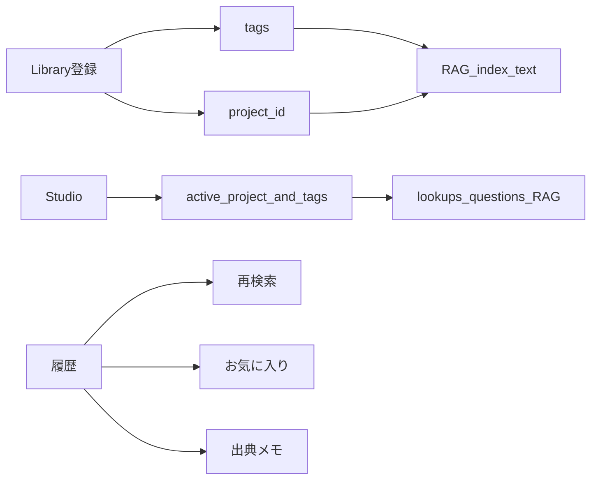

# 個人補助：タグ・案件・再検索・お気に入り・メモ

## 方針

- **人が付ける**（タグ・案件・メモ）。RAG／AIによる自動分類はしない。
- タグと案件はサーバー（資料メタ＋索引）に載せ、調べる／チャットの RAG クエリとフィルタに使う。
- お気に入り・出典メモ・再検索は Studio 中心（チェックリストと同様、セッション内＋書き出し）。

## 1. 案件フォルダ（API＋資料庫）

- 新ストア [`apps/api/app/project_store.py`](apps/api/app/project_store.py): owner 単位で `{ project_id, name }`
- API: `POST/GET /projects`、`DELETE /projects/{id}`（空のときだけ削除可）
- 資料メタに任意の `project_id`
- [`materials.py`](apps/api/app/materials.py) / [`rag.py`](apps/api/app/rag.py): 索引エントリに `project_id`。`retrieve(..., project_id=)` でその案件だけ検索
- [`/library`](apps/web/src/app/library/page.tsx): 案件の作成・選択。アップロード時に選択中案件を付与。一覧を案件で絞り込み

## 2. 作品・キャラタグ（手動）

- 資料に `tags: string[]`（例 `"OC:アオ"`, `"衣装:夏服"`）。自由入力＋既存タグから選択
- 登録／編集 API: `PATCH /materials/{doc_id}`（tags / project_id）
- 索引テキスト先頭に `tags: ...` を連結（ローカル検索のヒット向上）
- Studio: 「使うタグ」を複数選択 → lookups / questions の RAG クエリに空白連結で付与（Web grounding の prompt は物体ラベル中心のまま、**手元 RAG の query だけ**タグ付き）

[`lookup.py`](apps/api/app/lookup.py) 拡張:

- `lookup_object(..., tags=[], project_id="")`
- `answer_question(..., tags=[], project_id="")`
- request body に任意 `tags`, `project_id`

## 3. 「前回と同じ物体」の再検索

- 自動検索履歴の各カードに「もう一度調べる」
- その `object_id` で `lookupObject` を再実行（選択中タグ・案件もそのまま）
- チャット側は「同じ質問をもう一度」は出さない（編集コストが高いため。必要なら後回し）

## 4. お気に入り出典

- Studio state: `favorites: Record<url, true>`
- 出典カードにピン。`risk_level===easy` かつチェック4項目がすべて `unknown` 以外のとき「お気に入り候補」ヒント
- 履歴上部に「お気に入り」一覧
- 制作ログ書き出しに「お気に入り」節を追加（[`editorAssist.ts`](apps/web/src/lib/editorAssist.ts)）

## 5. 出典ごとの軽いメモ

- Studio state: `notes: Record<url, string>`（1行〜数行）
- [`EditorSources.tsx`](apps/web/src/components/EditorSources.tsx) のチェックリスト横に textarea
- 書き出しにメモを含める

## 主な変更ファイル

- API: `project_store.py`, `materials.py`, `material_store.py`, `rag.py`, `lookup.py`, `main.py`
- Web: `library/page.tsx`, `Studio.tsx`, `EditorSources.tsx`, `api.ts`, `messages.ts`, `editorAssist.ts`
- テスト: 案件フィルタ・タグ付き retrieve・PATCH materials

## やらない

- タグ／自作他者の AI 自動分類
- セッションを超えたクラウド永続（お気に入り・メモは今回セッション内＋書き出し）
- 案件のユーザー間共有
