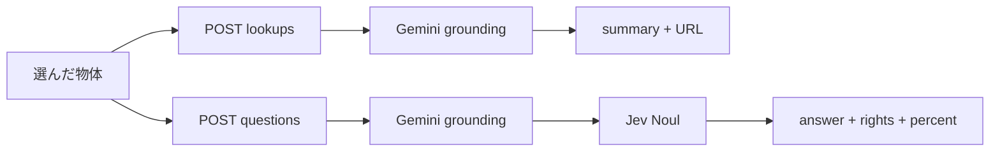

# 出典の自動検索とチャット判断の分離

## 現状

| 経路 | 実装 | 露出 |
|------|------|------|
| 自動検索 | [`lookup_object`](apps/api/app/lookup.py) … まとめ＋URL | `POST /lookups` と「この物体を調べる」で利用中 |
| チャット判断 | [`answer_question`](apps/api/app/lookup.py) ＋ [`verify_sources`](apps/api/app/verify.py) | **関数はあるが API・画面未接続** |
| Jev％ | Noul を閾値判定にだけ使用 | **レスポンス・UI に未返却** |

ご要望どおり、自動は「検索してまとめたまま」、チャットは「検索＋出典／ライセンス／著作権の判断＋Jev％」に分ける。

## 方針（採用）

- **自動検索**（既存ボタン）: まとめ・出典 URL・Search Suggestions のみ。権利欄と Jev は出さない。
- **チャット**（新規）: 選んだ物体＋自由入力 → 短い回答・出典・ライセンス／時期／著作権・**項目ごとの Jev％**。
- Jev％は Noul（0〜1）を **整数％**（例: `85`）で返す。出典ごとに `about` / `license` / `created` / `copyright`。未質問・未検出は `null`。
- 呼び出しはサーバーのみ。キーは返さない。

## API

1. [`apps/api/app/main.py`](apps/api/app/main.py)
   - 既存 `POST /photos/{photo_id}/lookups` は自動専用のまま。
   - 新規 `POST /photos/{photo_id}/questions`  
     body: `{ "object_id", "message" }`  
     → `answer_question(...)`  
     応答例: `{ "object_id", "message", "answer", "sources": [...] }`
2. [`apps/api/app/verify.py`](apps/api/app/verify.py)
   - 戻りに `jev` を追加（例: `{ "about": 85, "license": 72, "created": null, "copyright": 91 }`）。
   - `question` を state に入れ、「出典が質問に答えているか」を `about` に使う。
   - 権利文言は従来どおり引用スパン＋閾値以上のときだけ採用。％は閾値と別に常に返す。
3. [`docs/architecture.md`](docs/architecture.md) に `/questions` と `jev` フィールドを追記。

## 画面

1. [`apps/web/src/lib/api.ts`](apps/web/src/lib/api.ts) … `askQuestion` と型（`ChatTurn`, `Source.jev`）。
2. [`apps/web/src/components/Studio.tsx`](apps/web/src/components/Studio.tsx)
   - 「調べる」の下に入力＋送信（選んだ物体必須）。
   - **調べる履歴**（summary＋URL）と **チャット履歴**（Q&A＋権利＋Jev％）を分けて表示。
   - 自動側の出典は URL／タイトルのみ（権利行は出さない）。
3. [`apps/web/src/lib/messages.ts`](apps/web/src/lib/messages.ts) に日本語／英語ラベルを追加。

## 検証

- API: 空 `message` は業務エラー。Jev 未設定時は権利 `unknown`・％ `null` で落ちないこと。
- 画面: 自動とチャットが別履歴になること。％が整数で見えること。
- 可能なら既存 pytest／型チェックを実行。
