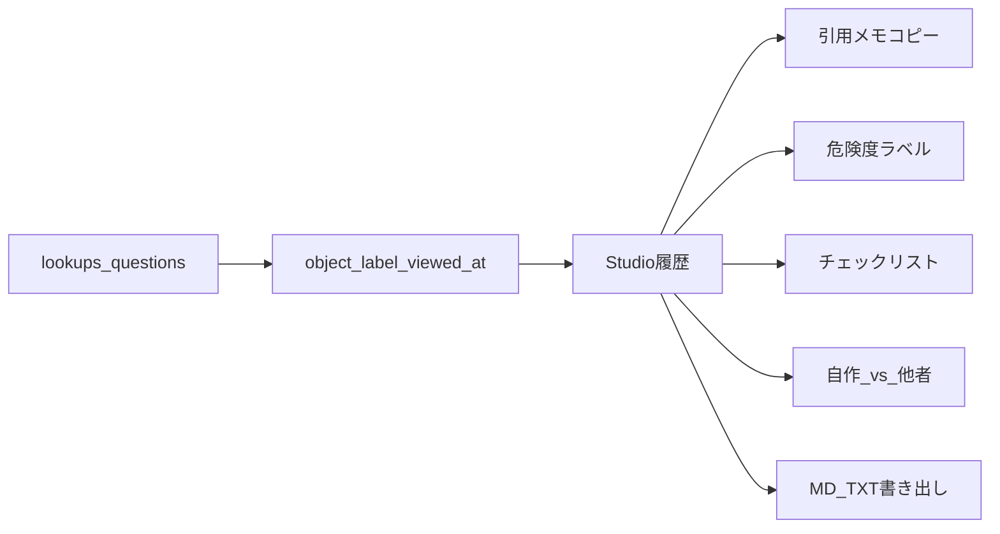

# 編集者向け出典補助（6点）

## 方針

- 法的断定はしない。ラベルは「目安」、クレジットは「下書き」。
- 危険度・引用文の合成は **コード**（[`apps/web/src/lib/editorAssist.ts`](apps/web/src/lib/editorAssist.ts) 新設＋API 側でも同ルールで `risk_level` / `credit_memo` を付与）。
- 画面の主戦場は [`Studio.tsx`](apps/web/src/components/Studio.tsx)。既存履歴を拡張し、別ダッシュボードは作らない。

## 1. API：履歴メタ＋出典の補助フィールド

[`apps/api/app/main.py`](apps/api/app/main.py) の lookups / questions 保存時に必ず付ける:

- `object_label`（選んだ物体名）
- `viewed_at`（ISO8601 UTC）

出典ごとに（チャットの judged sources と、自動検索の links 両方）:

| フィールド | 内容 |
|------------|------|
| `risk_level` | `easy` \| `conditional` \| `review` |
| `credit_memo` | コピー用1ブロック（タイトル／URL／種別／ライセンス／取得日） |

合成ルール（断定しない・固定）:

- `easy`: `own_claim` またはライセンスが CC0 / Public Domain / パブリックドメイン
- `conditional`: CC-BY 系・All rights reserved・Creative Commons（CC0以外）
- `review`: `unknown`・空・上記以外、または `web`/`third_party` で Jev の license/copyright が閾値未満で未採用

共通関数: [`apps/api/app/editor_assist.py`](apps/api/app/editor_assist.py)（新設）。Web 側に同ルールを複製。

## 2. 画面：引用メモ・危険度・履歴行

[`Studio.tsx`](apps/web/src/components/Studio.tsx) / [`messages.ts`](apps/web/src/lib/messages.ts):

- 各出典に危険度バッジ（使いやすい／条件あり／要確認）＋「引用メモをコピー」
- 履歴の見出しに **物体名・日時・種別件数**（例: `猫 · 2026-09-20 21:00 · 自作1 / 他者2`）

## 3. チェックリスト（人の最終判断）

出典ごと（`url` キー）に4項目を `yes` / `no` / `unknown`:

- クレジット要る？
- 改変可？
- 商用？
- 自作と混同していない？

状態は Studio の React state（セッション中保持）。Jev は触らない。書き出し時に含める。

## 4. 自作と他者の並比

同じ lookup／chat ターン内で sources を2列:

- 左: `material_kind === own_work`
- 右: `third_party` + `web`

片方空なら「なし」と表示。

## 5. セッション書き出し

Studio に「制作ログを書き出し」ボタン:

- そのセッションの自動検索＋チャット＋チェックリストを Markdown に整形
- `.md` と `.txt`（中身同じ）をダウンロード
- クライアント生成のみ（追加 API 不要）

## 6. 型・文言・検証

- [`api.ts`](apps/web/src/lib/api.ts): `risk_level`, `credit_memo`, `object_label`, `viewed_at`
- pytest: `risk_level` / `credit_memo` の合成ケース、lookup 応答に `object_label`・`viewed_at`
- `npm run build`

## やらない

- 法的「商用OK確定」
- チェックリストの永続DB（今回はセッション内＋書き出し）
- 新規画面の追加
