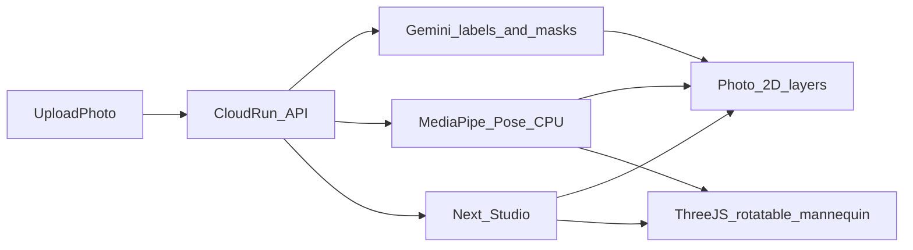

# 絵描き向け観察ビュー＋回転 3D 計画

## 絵描き／漫画家向けの判定

| 手段 | 誰向け | 判定 |
|------|--------|------|
| 写真上マスク＋元画像切替 | 絵描きの資料観察 | **Must** |
| 写真上スケルトン | ジェスチャ・関節 | **Must** |
| 写真上筋肉ラベル | デッサン補助 | **Must** |
| **同ポーズ 3D をドラッグ回転** | 漫画家・体積把握（友達要望） | **Must** |
| 写真の解剖テクスチャ生成 | — | やらない（誤誘導） |
| HF / Cloud Run GPU | — | やらない |

2D は「写真との対応」、3D は「回して体積を読む」。両方とも本線。実装順は API（マスク＋姿勢）→ 2D 切替 → 3D 回転（姿勢データが揃ってから）。

## いまの症状

- 骨格／筋肉は点の載せ替えのみで、写真も 3D も変わらない。
- 矩形検出が粗く、輪郭に沿わない。

## 目指す体験

1. **元写真**（常に戻せる）
2. **マスク**（物体に沿った多角形。選択もここ）
3. **骨格**（MediaPipe 接続線を写真に）
4. **筋肉**（主要部位ラベルを写真に）
5. **3D**（同じポーズの簡略人体をドラッグ回転。筋肉／骨格メッシュ切替）

表示ライブラリは **Three.js（MIT）**。他参加者利用実績あり・ライセンス問題になりにくい。Babylon 等でも可だが、依存を一つに固定する。

## Hugging Face / Google Cloud

- Gemini: ラベル＋多角形マスク（必須 AI、API のみ）
- MediaPipe Pose: API コンテナに `.task` 同梱・CPU（2D 骨格と 3D ポーズの共通入力）
- Three.js: Web のみ。推論・秘密なし
- HF Hub / GPU: 使わない

## 実装スコープ

### やる

1. UX: `photo` | `mask` | `skeleton` | `muscle` | `view3d`。元画像へ常時復帰。
2. API: Gemini `contour`（人物必須）＋ MediaPipe `pose_landmarks`／骨エッジ。
3. 筋肉 2D: ランドマーク近傍に日本語ラベル。
4. 3D: 簡略人体（primitive または再配布可 GLTF）。OrbitControls で回転。MediaPipe から簡易ボーン合わせ。筋肉／骨格レイヤ表示切替。UI に「デッサン補助。医学的正確さは保証しない」。

### やらない

- 写真ピクセルの解剖塗り替え、HF/GPU、動物の高精度 3D、イラスト生成。
- 医学級の筋肉シミュレーション。

## 主要変更ファイル

- [`apps/api/app/analyze.py`](apps/api/app/analyze.py)、新規 `pose.py`、`requirements.txt`、API Dockerfile
- [`apps/web/src/components/Studio.tsx`](apps/web/src/components/Studio.tsx)、新規 `AnatomyViewer.tsx`、`three` 依存、`api.ts`、`messages.ts`、CSS
- docs: idea / architecture / tasks / demo-script

## リスク

- 3D ポーズ合わせは近似。デモは「回して体積を見る」を見せる。
- GLTF を同梱する場合は再配布ライセンスを確認。迷うなら primitive 人体でライセンスリスクを避ける。
- MediaPipe は全身写真向き。

## コスト感（取得日 2026-09-21）

- 追加は Cloud Run CPU＋既存 Gemini。Three.js はクライアント計算のみで課金なし。
- 出典: [Cloud Run pricing](https://cloud.google.com/run/pricing)、[Pose Landmarker](https://developers.google.com/edge/mediapipe/solutions/vision/pose_landmarker/python)
