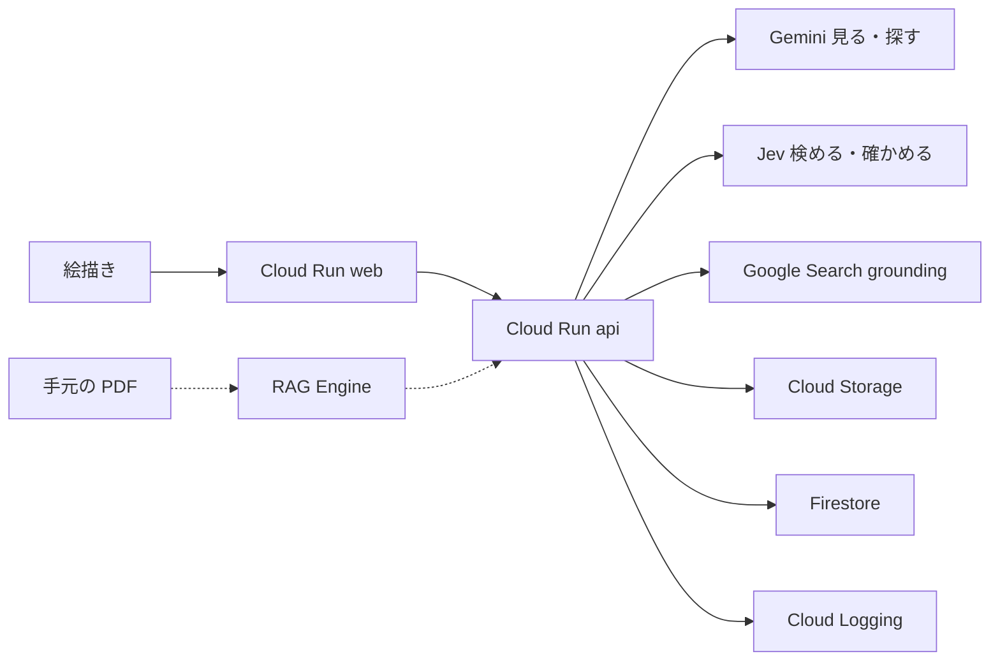

# Google Cloud 設計

正本はプロダクトが [idea.md](../idea.md)、いまのクラウド設定が [status.md](deploy/status.md)、キー名が [env-contract.md](deploy/env-contract.md)。このファイルは、どのクラウド部品が何をするか。

確認日: 2026-09-19。UI の色やフォントはここには書かない。

## 大会に合わせた決め

| 大会の条件 | この設計 |
|------------|----------|
| 実行プロダクトが1つ以上 | Cloud Run を2つ（画面と API） |
| Google Cloud の AI が1つ以上 | Gemini Enterprise Agent Platform。`GOOGLE_GENAI_USE_ENTERPRISE=True` |
| ローカルだけでは不可 | 審査用 URL は Cloud Run |
| 約3分の動画で伝わる | サンプル写真 → 層と関節 → 出典履歴の1本 |
| 自律性・制御・記録 | 見る、検める、探す、確かめる、残すを API がやり、ログに段を出す |
| ソーシャルログインは避ける | サンプル写真はログインなし |
| 秘密を Git に置かない | 本番は ADC。キーはブラウザに出さない |

## 使うもの

| 部品 | 役割 | 今 |
|------|------|----|
| Cloud Run `web` | 操作画面。ポート 3000 | 必須 |
| Cloud Run `api` | 写真の解析、検索、履歴。ポート 8000 | 必須 |
| Gemini（Agent Platform） | 写真の層と関節。選んだ物体の検索出典 | 必須。各1回 |
| Jev（TypeSafe） | 枠と関節を出すか。引用が権利を書いているか | テキストだけ。写真は送らない |
| Google Search grounding | 選んだ物体のウェブ出典 | 探す段の Gemini に付く |
| Cloud Storage | 上げた写真。公開バケットにしない | 必須 |
| Firestore | 出典履歴（URL、ライセンス、時期、著作権） | 必須 |
| Cloud Logging | 見る / 検める / 探す / 確かめる / 残す の記録 | 必須 |
| RAG Engine | ユーザーが持っている PDF からページ提案 | 後回し |

ブラウザから Gemini を呼ばない。画面は `NEXT_PUBLIC_API_BASE_URL` だけを知る。

## 全体

点線は後回し。MVP では PDF を取りに行かない。

## エージェントの1回

1. **見る.** 写真を Gemini に1回だけ渡し、物体の名前と枠、関節の候補を JSON で受け取る。
2. **検める.** その JSON だけを Jev に1回渡す。確信度が低い枠と関節は消す。主対象がはっきりすれば `is_primary` を更新する。Jev が使えないときは、Gemini の確信度のままにする。
3. **探す.** 選んだ物体の名前だけを Gemini と Google Search grounding に1回渡す。写真は再送しない。ライセンス文は書かせない。出典 URL と短い引用を受け取る。
4. **確かめる.** 引用だけを Jev に1回渡す。ライセンス・時期・著作権は、引用の中に語句があり、かつ Jev がその語句を認めたときだけ残す。なければ `unknown`。
5. **残す.** 出典 URL、タイトル、ライセンス、作成時期、著作権を Firestore に書く。モデルは呼ばない。

ピクセル単位の切り抜きと、関節座標の別モデル補正はしない。Jev は出すかだけを決める。

## API

JSON は snake_case。失敗は `{ "error": { "code", "message" } }`。

| メソッド | パス | すること |
|----------|------|----------|
| GET | `/health` | 死活。認証不要 |
| POST | `/photos` | 写真を受け、層と関節を返す |
| POST | `/photos/{photo_id}/lookups` | 選んだ物体を調べ、出典履歴を返す |
| GET | `/photos/{photo_id}/lookups` | その写真の履歴一覧 |

`lookups` の各出典:

| フィールド | 中身 |
|------------|------|
| `url` | 出典 URL |
| `title` | ページ名。無ければ空 |
| `license` | 文に書いてあればその文字列。無ければ `unknown` |
| `created` | 作成時期。無ければ `unknown` |
| `copyright` | 著作権の記載。無ければ `unknown` |

Grounding を使う応答では、API が返した Search Suggestions を画面に出す。出さないと利用条件を満たさない。出典: [Grounding with Google Search](https://docs.cloud.google.com/gemini-enterprise-agent-platform/models/grounding/grounding-with-google-search)。

ページ全文を別途クロールしない。ライセンスがスニペットに無ければ未確認のまま。

## データ

- 写真の実体は Cloud Storage `illustration-support-photos`（大阪 `asia-northeast2`、公開禁止）。Firestore にはバケット内のパスだけ。
- バケットは非公開。ブラウザへは API 経由の短命な表示だけ。署名 URL の全文はログに出さない。
- 履歴に写真の画素や PDF 本文は入れない。

## セキュリティ

- 本番の Gemini は Cloud Run のサービスアカウント（ADC）。`GOOGLE_API_KEY` はローカル試作だけ。
- ログに出してよいのは、処理段、モデル名、出典 URL、`unknown` かどうか。画像バイト、キー、署名 URL は出さない。
- こちらから本をダウンロードしない。Kindle の非公式取得もしない。
- 上げられる写真の大きさに上限を付ける。超えたら業務エラーとして `error.message` を返す。Gemini の失敗はシステムエラーとして同じ形で返し、中身はログだけ。

## 後回しの PDF

ユーザーが権利を持つ PDF を Cloud Storage に置き、[RAG Engine](https://docs.cloud.google.com/gemini-enterprise-agent-platform/build/rag-engine/rag-quickstart) のコーパスへ入れる。提案にはファイル名を付ける。ページ番号はチャンクにあれば出し、無ければ `unknown`。NotebookLM は使わない。

## 未確認

- 関節の点を Gemini だけで安定して取れるか。ダメなら枠と名前だけに落とす。座標を直す別モデルは足さない
- RAG のチャンクがページ番号を常に持つか
- Gemini の場所は `global`。写真バケットは作成済みで大阪。Cloud Run は未作成。詳細は [status.md](deploy/status.md)
