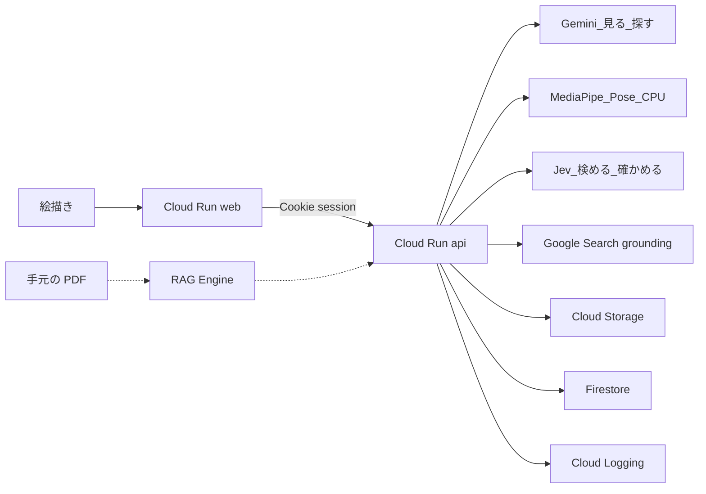
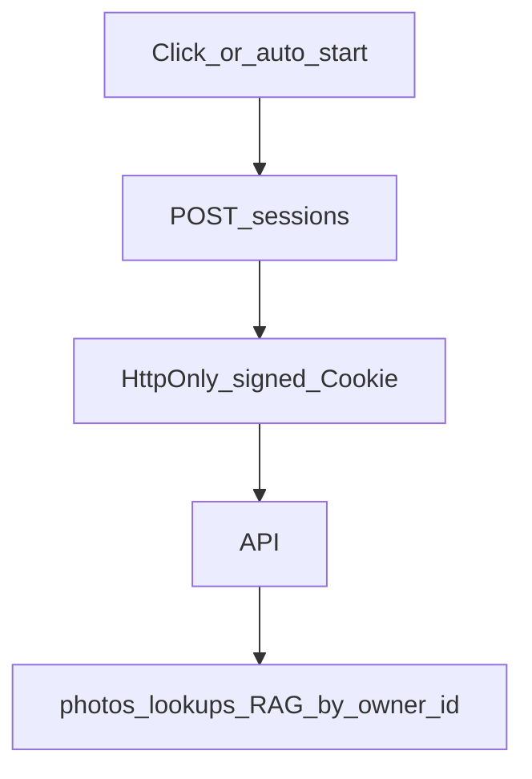

# Google Cloud 設計

正本はプロダクトが [idea.md](../idea.md)、いまのクラウド設定が [status.md](deploy/status.md)、キー名が [env-contract.md](deploy/env-contract.md)。このファイルは、どのクラウド部品が何をするか。

確認日: 2026-09-19。UI の色やフォントはここには書かない。

## 大会に合わせた決め

| 大会の条件 | この設計 |
|------------|----------|
| 実行プロダクトが1つ以上 | Cloud Run を2つ（画面と API） |
| Google Cloud の AI が1つ以上 | Gemini Enterprise Agent Platform。`GOOGLE_GENAI_USE_ENTERPRISE=True` |
| ローカルだけでは不可 | 審査用 URL は Cloud Run |
| 約3分の動画で伝わる | サンプル写真 → 層と関節 → 出典履歴の1本 |
| 自律性・制御・記録 | 見る、検める、探す、確かめる、残すを API がやり、ログに段を出す |
| ソーシャルログインは避ける | メール／Google 必須にしない。ワンクリックでセッション開始 |
| セキュリティ（隔離） | 写真・履歴は `owner_id`（セッション）単位。ユーザー間共有しない |
| 秘密を Git に置かない | 本番は ADC。キーはブラウザに出さない |

## 使うもの

| 部品 | 役割 | 今 |
|------|------|----|
| Cloud Run `web` | 操作画面。ポート 3000 | 必須 |
| Cloud Run `api` | 写真の解析、検索、履歴。ポート 8000 | 必須 |
| Gemini（Agent Platform） | 選んだ物体の検索出典。写真の座標推定には使わない | 探す段 |
| MediaPipe Pose full（CPU） | 見えている関節。モデルが無ければ lite に落とす | API コンテナに `.task` 同梱 |
| MediaPipe Image Segmenter（CPU） | 人の前景マスク。写っている部分だけの輪郭 | `selfie_segmenter.tflite` 同梱 |
| Jev（TypeSafe） | 枠と関節を出すか。引用が権利を書いているか | テキストだけ。写真は送らない |
| Google Search grounding | 選んだ物体のウェブ出典 | 探す段の Gemini に付く |
| Cloud Storage | 上げた写真。公開バケットにしない | 必須 |
| Firestore | 出典履歴（URL、ライセンス、時期、著作権） | 必須 |
| Cloud Logging | 見る / 検める / 探す / 確かめる / 残す の記録 | 必須 |
| RAG Engine | ユーザーが持っている PDF からページ提案 | 後回し |

ブラウザから Gemini を呼ばない。画面は `NEXT_PUBLIC_API_BASE_URL` だけを知る。

## 全体

点線は後回し。MVP では PDF を取りに行かない。

## セッションとテナント隔離

主催者方針: ゲストのように入れるが、**ユーザー間でデータが共有される設計は減点**。Firebase Auth / Supabase はハッカソン提出物では使わない。

| 項目 | 内容 |
|------|------|
| 入り方 | `POST /sessions` で一意の `session_id` を発行。HttpOnly Cookie（署名付き） |
| 認可単位 | `owner_id = session_id`。写真・出典履歴・チャットはすべてこの配下 |
| 共有してよいもの | 読み取り専用のサンプル写真カタログのみ。解析結果は各セッション内 |
| 禁止 | 固定共有デモアカウント、`photo_id` だけの横断読み取り、クエリの `user_id` なりすまし |
| 公開後 | 端末内継続で足りるならセッションのまま可。別端末のアカウントが必要ならそのとき IdP を足す |

## エージェントの1回

1. **見る.** MediaPipe Image Segmenter で人の前景マスク（写っている範囲だけ）を輪郭にする。MediaPipe Pose full で見えている関節だけを取る。座標推定に Gemini は使わない。レスポンスに `pose`（landmarks / edges / muscles）を付ける。
2. **検める.** 見る段では Jev を使わない（専用モデルの点を言語判定で消さない）。出典の権利判定は探す段の Jev のまま。
3. **探す（自動）.** 選んだ物体の名前だけを Gemini と Google Search grounding に1回渡す。写真は再送しない。短いまとめと出典 URL を返す。権利判断はしない。
4. **探す＋確かめる（チャット）.** 選んだ物体とユーザーの質問を grounding と手元 RAG に渡す。出典の `material_kind` を Jev の state に入れて区分ごとに判定する。`own_work` は関連％のみ（権利は `own_claim`）。`web` / `third_party` は引用スパン＋権利 Jev。各 Noul は整数％。
5. **残す.** 自動検索とチャットの履歴を Firestore に書く。モデルは呼ばない。

画面は元画像／マスク／骨格／筋肉／3D（Three.js・ドラッグ回転）を切り替えられる。骨格と 3D は顔の点・指を描かず、頭は1つ、胴・上腕・太ももを太くする。奥行きは肩幅に対して正規化する。医学的正確さは保証しない。

ピクセル単位の解剖テクスチャ生成や Hugging Face GPU 推論はしない。MediaPipe は公式 `.task` を Docker／ローカルに同梱するだけ。Jev は出すかと％を返す。

## API

JSON は snake_case。失敗は `{ "error": { "code", "message" } }`。

| メソッド | パス | すること |
|----------|------|----------|
| GET | `/health` | 死活。セッション不要 |
| POST | `/sessions` | セッション発行または既存 Cookie の確認。Set-Cookie |
| GET | `/sessions/me` | 現在のセッション。無ければ 401 |
| POST | `/photos` | 写真を受け、層・輪郭・`pose` を返す。セッション必須 |
| POST | `/photos/{photo_id}/lookups` | 自動検索。まとめと出典 URL。任意で `tags` / `project_id`（手元 RAG 用）。所有者のみ |
| GET | `/photos/{photo_id}/lookups` | 自動検索の履歴一覧。所有者のみ |
| POST | `/photos/{photo_id}/questions` | チャット判断。回答・権利・Jev％。任意で `tags` / `project_id`。所有者のみ |
| GET | `/photos/{photo_id}/questions` | チャット履歴一覧。所有者のみ |
| POST | `/materials` | 手元資料の登録（クエリ: `material_kind` 必須、任意 `project_id`）。所有者のみ |
| GET | `/materials` | 手元資料一覧（任意 `project_id` で絞り込み）。`tags`（owner 内の既存タグ）も返す。所有者のみ |
| PATCH | `/materials/{doc_id}` | `tags` / `project_id` の更新と再索引。所有者のみ |
| DELETE | `/materials/{doc_id}` | 手元資料の削除。所有者のみ |
| GET | `/projects` | 案件フォルダ一覧。所有者のみ |
| POST | `/projects` | 案件作成（`name`）。所有者のみ |
| DELETE | `/projects/{project_id}` | 案件削除（配下に資料が無いときだけ）。所有者のみ |

`lookups` の各出典:

| フィールド | 中身 |
|------------|------|
| `url` | 出典 URL |
| `title` | ページ名。無ければ空 |

`questions` の各出典:

| フィールド | 中身 |
|------------|------|
| `url` | 出典 URL |
| `title` | ページ名。無ければ空 |
| `license` | 文に書いてあればその文字列。無ければ `unknown` |
| `created` | 作成時期。無ければ `unknown` |
| `copyright` | 著作権の記載。無ければ `unknown` |
| `jev` | `{ about, license, created, copyright }`。各 0〜100 の整数、または `null` |
| `material_kind` | `web` \| `own_work` \| `third_party` |

Grounding を使う応答では、API が返した Search Suggestions を画面に出す。出さないと利用条件を満たさない。出典: [Grounding with Google Search](https://docs.cloud.google.com/gemini-enterprise-agent-platform/models/grounding/grounding-with-google-search)。

ページ全文を別途クロールしない。ライセンスがスニペットに無ければ未確認のまま。

## データ

- 写真の実体は Cloud Storage `illustration-support-photos`（大阪 `asia-northeast2`、公開禁止）。パスは `owners/{owner_id}/...`。Firestore にはバケット内のパスと `owner_id` だけ。
- バケットは非公開。ブラウザへは API 経由の短命な表示だけ。署名 URL の全文はログに出さない。
- 履歴に写真の画素や PDF 本文は入れない。
- 他人の `photo_id` を推測しても、`owner_id` 不一致なら存在を明かさず 404 相当（業務エラー `object_not_found`）。

## セキュリティ

- 本番の Gemini は Cloud Run のサービスアカウント（ADC）。`GOOGLE_API_KEY` はローカル試作だけ。
- セッション Cookie は `SESSION_SIGNING_SECRET` で HMAC 署名。秘密と Cookie 全文はログに出さない。
- ログに出してよいのは、処理段、モデル名、出典 URL、`unknown` かどうか。画像バイト、キー、署名 URL は出さない。
- こちらから本をダウンロードしない。Kindle の非公式取得もしない。
- 上げられる写真の大きさに上限を付ける。超えたら業務エラーとして `error.message` を返す。Gemini の失敗はシステムエラーとして同じ形で返し、中身はログだけ。
- CORS は本番オリジンに限定し、Cookie 送受信のため credentials を許可する。

## 手元資料（RAG・material_kind）

登録画面は `/library`。二領域ドロップで `own_work`（自分の作品）と `third_party`（他者の資料）を申告する。AI は種別を推測しない。

| ルール | 内容 |
|--------|------|
| 保存パス | `owners/{owner_id}/materials/{material_kind}/{doc_id}/...`（ローカルは `apps/api/.data/materials/`） |
| 原寸上限 | 100MB／ファイル。解析写真は従来どおり 10MB |
| 形式 | JPEG/PNG/WebP、PDF、docx、xlsx、md、txt |
| 索引 | 画像は長辺約 2048px の派生物。Office／テキストは本文抽出。原寸は GCS（またはローカル）に残す |
| 案件 | 任意の `project_id`（`/projects`）。一覧絞り込みと `retrieve(..., project_id=)` |
| タグ | 人が付ける `tags: string[]`（例 `OC:アオ`）。索引先頭に `tags: ...` を連結。AI 自動分類はしない |
| コーパス | owner ごと。横断禁止。案件のユーザー間共有もしない |
| 自動提示 | 「調べる」「チャット」で物体ラベル（＋質問＋選択中タグ）から retrieve し、Web 出典とマージ。Web grounding の prompt は物体ラベル中心のまま |
| 著作権 | Jev に `material_kind` を渡す。`own_work` は関連％＋`own_claim`（権利 Noul なし）。`third_party` / `web` は引用＋権利 Jev（指示に区分を含める） |
| セッション上限 | 30件または合計 2GB |
| 禁止 | 全ユーザー共有コーパス、カメラ RAW の直接登録、タグ／種別の AI 自動分類 |

`RAG_ENABLED=true` のとき Vertex AI RAG Engine。未設定時はローカル簡易索引（デモ用）。

## 個人補助・編集者向け（Studio）

Must 外。デモを速くするための手元作業。

| 機能 | どこ | 永続 |
|------|------|------|
| 使うタグ・検索する案件 | Studio → lookups / questions の RAG クエリとフィルタ | 資料メタはサーバー（owner 単位）。選択状態は画面 |
| もう一度調べる | 自動検索履歴カード | 再実行のみ。チャットの「同じ質問をもう一度」は出さない |
| お気に入り出典 | 出典カードのピン。履歴上部一覧 | **セッション内のみ**（クラウド永続しない）。制作ログ書き出しに「お気に入り」節 |
| 出典メモ | チェックリスト横の textarea | **セッション内のみ**。書き出しに含める |
| 危険度目安・引用メモ・編集チェック・自作／他者比較・制作ログ書き出し | Studio / `EditorSources` | チェックもセッション内。書き出しは md/txt ダウンロード |

お気に入り候補ヒント: `risk_level === easy` かつチェック4項目がすべて `unknown` 以外。

## 未確認

- MediaPipe モデル欠落時は姿勢なしで Gemini 結果のみ返す。ローカルは `apps/api/scripts/download_pose_model.ps1` で取得
- RAG Engine のチャンクがページ番号を常に持つか
- Gemini の場所は `global`。写真バケットは作成済みで大阪。Cloud Run は未作成。詳細は [status.md](deploy/status.md)
